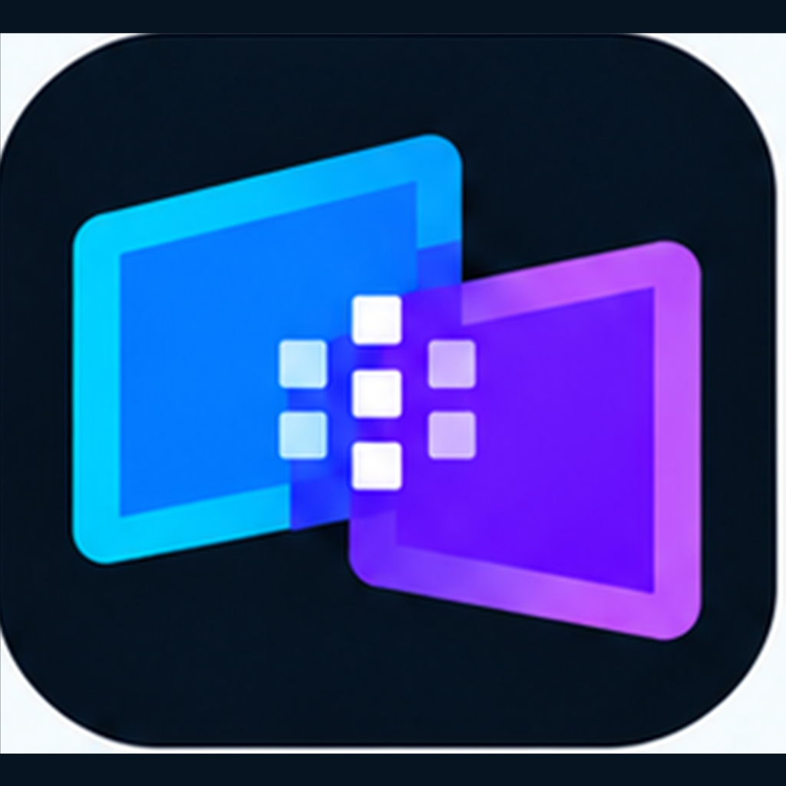

<p align="center">
  
</p>

# DisplayMesh

DisplayMesh is a cross-platform virtual-display project for **macOS and Windows hosts**, with **iPhone and iPad receivers**.

The goal is to let a computer create a real extended display and stream it to another computer or Apple mobile device over **USB or Wi-Fi**, while preserving low latency, high resolution and interactive touch input.

> **Current `main`: 0.2.3.** The Apple receiver includes the real low-latency H.264 receive path (DMP video packet → Annex-B parser → VideoToolbox → NV12 → Metal), bounded decoder work, keyframe recovery, live diagnostics and EN/ES/System UI. The Apple↔macOS path now uses mutual persistent P-256 identities plus signed ephemeral P-256 ECDH, HKDF-SHA256 and ChaCha20-Poly1305 protection for every post-pairing DMP frame; plaintext post-pairing traffic fails closed. Receiver queue/decode telemetry, adaptive bitrate/raster and encrypted RTT probes are wired into the macOS harness. Windows includes the IddCx/D3D11 virtual-display foundation and a concrete asynchronous Media Foundation encode adapter/coordinator. WDK hardware validation, live IddCx→NV12→MFT wiring, USB transport, independent security review and end-to-end hardware acceptance remain release blockers.

## Capability status

The lists below distinguish code that exists on current `main` from product targets. A capability is not considered release-ready until its platform-specific hardware acceptance gate in [docs/TESTING.md](docs/TESTING.md) passes.

### Implemented on current `main`

- iPhone/iPad receiver with low-latency H.264 decode through VideoToolbox, NV12 Metal presentation, panel-capability reporting, touch/Pencil sample capture, diagnostics, and English/Spanish/System UI.
- macOS developer path that creates a real temporary virtual display, captures it with ScreenCaptureKit, encodes H.264 with VideoToolbox, and streams it to the Apple receiver over the current LAN/TCP DMP path.
- Persistent P-256 peer identities, signed ephemeral P-256 ECDH, HKDF-SHA256, and ChaCha20-Poly1305 protection for Apple↔macOS post-pairing DMP traffic.
- Bounded decode/presentation work, stale-frame handling, keyframe recovery, receiver telemetry, encrypted RTT probes, and adaptive bitrate/raster control.

### Implemented foundation; release validation still pending

- Windows IddCx/D3D11 virtual-display foundation plus the asynchronous Media Foundation encode adapter/coordinator.
- 1080p60 and 1440p60 are current acceptance targets, not universal performance claims; they still require end-to-end measurements on representative hardware.
- Windows hardware behavior, WDK deployment/signing, and live IddCx → NV12 → Media Foundation integration remain release gates.

### Product targets / not production-ready yet

- USB to iPhone/iPad through usbmux.
- Complete macOS ↔ Windows, macOS ↔ macOS, and Windows ↔ Windows product paths.
- Production-ready mirror mode and complete mouse/keyboard/touch system-injection mappings on every supported host.
- HEVC / AV1 where hardware support makes sense.
- 4K60 and 120 Hz modes after the complete virtual-display, capture, codec, transport, decoder, renderer, and panel path is validated.

## Latency strategy

DisplayMesh optimizes for interaction freshness instead of media-player behavior.

- no deliberate playback buffer
- bounded decoder work
- realtime VideoToolbox decode on Apple receivers
- Metal presentation from NV12 surfaces
- keyframe request after decode loss or backlog reset
- input/control priority over queued video
- adaptive controller reduces bitrate before reducing encoded raster
- persistent congestion may step stream raster from 100% → 85% → 75% → 67%
- recovery restores resolution before aggressively increasing bitrate

## Connection bindings

DisplayMesh keeps the physical connection separate from the wire protocol:

| Connection | Protocol model | Current status |
| --- | --- | --- |
| Wi-Fi / LAN | TCP today; QUIC remains an architectural option | Apple receiver ↔ macOS developer path is wired |
| Ethernet | TCP / future QUIC | Uses the same LAN transport model; end-to-end product acceptance is still pending |
| USB to iPhone/iPad | TCP through usbmux | Target architecture; not wired as a production path yet |

The table describes the transport model, not a claim that every binding is currently release-ready. USB remains a release blocker on current `main`.

## Architecture

```text
apps/control
    │
    ├── displaymesh-core
    │       ├── device/session model
    │       ├── capability negotiation
    │       ├── DMP framing + video packet contract
    │       ├── adaptive quality controller
    │       ├── touch model
    │       └── backend lifecycle
    │
    ├── macOS host backend
    │       ├── virtual display
    │       ├── ScreenCaptureKit
    │       └── VideoToolbox encoder
    │
    ├── Windows host backend
    │       ├── IddCx virtual display driver
    │       ├── DirectX / D3D11
    │       └── Media Foundation encoder
    │
    └── Apple receiver
            ├── Network.framework listener
            ├── VideoToolbox H.264 decoder
            ├── Metal NV12 renderer
            └── UIKit touch / Pencil capture
```

See [ARCHITECTURE.md](docs/ARCHITECTURE.md), [ROADMAP.md](docs/ROADMAP.md), [DMPv1.md](protocol/DMPv1.md), [QUALITY_GATES.md](docs/QUALITY_GATES.md), and the [native acceptance plan](docs/TESTING.md).

## Build the shared control app

Install the stable Rust toolchain and run:

```bash
cargo run -p displaymesh-control
```

## Generate the iPhone/iPad receiver project

Install XcodeGen, then run:

```bash
cd platforms/apple-receiver
xcodegen generate
open DisplayMeshReceiver.xcodeproj
```

## Languages

- English: this file
- Español: [README.es.md](README.es.md)

## Repository policy

DisplayMesh is an independent implementation. Do not copy OpenDisplay branding, artwork, or source code into this repository. Interoperability work should be based on public protocol/API documentation and clean implementation boundaries.


## macOS developer end-to-end path

A developer orchestration script now joins the virtual-display proof harness with the ScreenCaptureKit/VideoToolbox media harness:

```bash
scripts/run-macos-virtual-session.sh --host <iphone-or-ipad-ip>
```

It creates a temporary DisplayMesh virtual display, captures that exact display, encodes low-latency H.264, streams it to the Apple receiver, and tears the virtual display down on exit. The TCP binding is protected after pairing with the authenticated DMP secure-session layer. It remains a development integration path until the transport/security design receives independent review and the production host, USB and hardware acceptance gates are complete.

## Contact, support, and feedback

Have a **question**, **suggestion**, found a **bug**, or want to share **feedback** about DisplayMesh? Use the project's GitHub Issues form:

**[Open the contact and feedback form](https://github.com/tiburonns/DisplayMesh/issues/new?template=feedback.yml)**

Choose the category that best fits: **Question, Suggestion, Bug, Feedback, Compatibility, or Other**. Include the app version, device/OS, and reproduction steps when relevant.

Do not post passwords, tokens, keys, private addresses, or other sensitive personal information. For security vulnerabilities, follow the process in `SECURITY.md` when available.

